# Chinese Comprehensible Input — Obsidian Plugin

| Desktop — reading view | Mobile — word lookup |
| :---: | :---: |
| 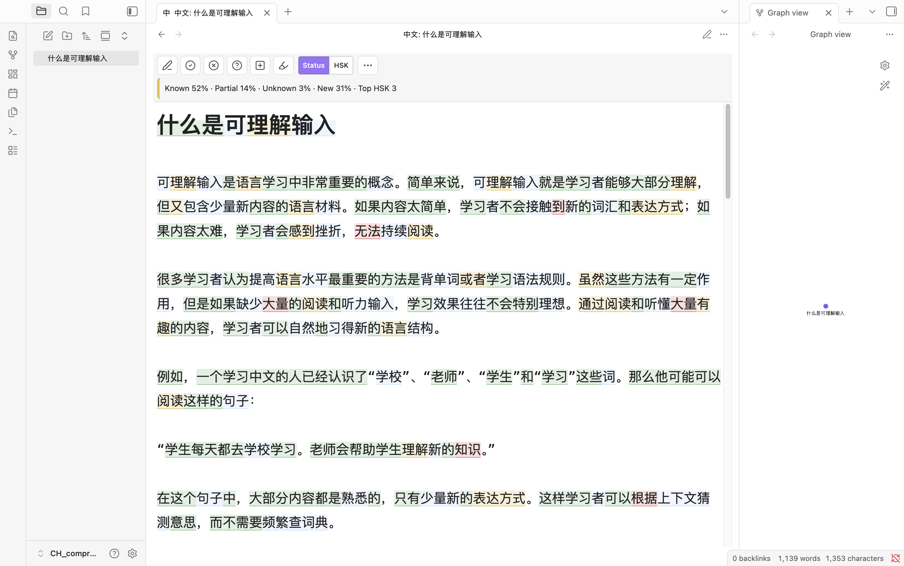 | 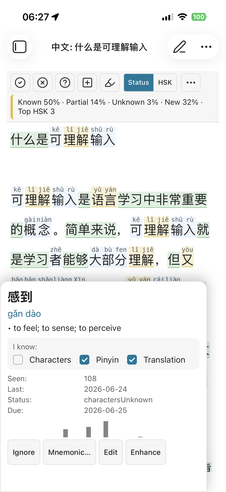 |

<p align="center"><em>The same note rendered for reading. A runnable demo lives at <a href="resources/example.md">resources/example.md</a>.</em></p>

Turn any Chinese note in Obsidian into a learner-friendly comprehensible-input reading environment. Dictionary-aware tokenization, exposure tracking, SRS, and optional OpenAI-compatible AI story generation. Works on desktop and mobile (no Node/Electron at runtime).

## Tour the interface

A quick visual walkthrough. The green numbers on each screenshot map to the lists
below; deeper explanations live in [`docs/`](./docs/index.md).

### Reading toolbar (desktop)

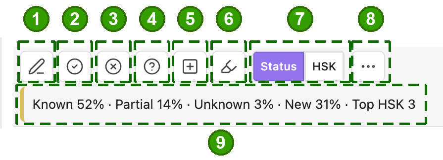

- **1 · Edit** — toggle between read and edit (type Chinese with annotations off).
- **2 · Known**, **3 · Unknown**, **4 · Partial** — tap a word to set its status.
- **5 · Add custom word** — tap characters to build a dictionary entry.
- **6 · Highlighter** — arm tap-to-format mode (see [Formatting](./docs/formatting.md)).
- **7 · Status / HSK** — color words by learning status or by HSK level.
- **8 · More** — the display menu (below).
- **9 · Note status bar** — Known / Partial / Unknown / New %, top HSK; tap for full stats.

### Display menu (the "More" button)

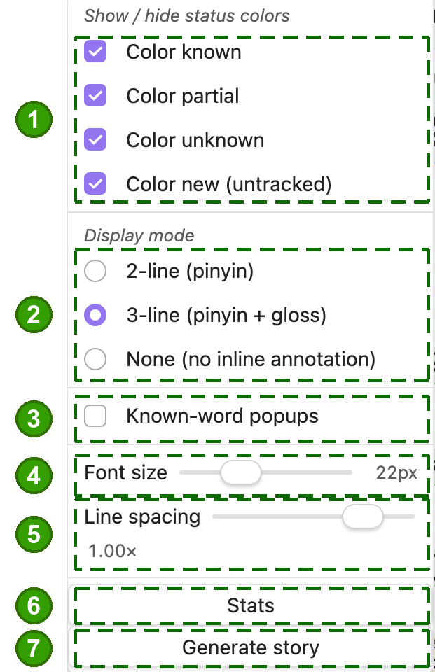

- **1 · Show / hide colors** — per-status (or per-HSK) tint toggles.
- **2 · Display mode** — 2-line (pinyin), 3-line (pinyin + gloss), or None.
- **3 · Known-word popups** — allow tapping words you already know.
- **4 · Font size**, **5 · Line spacing** — reader sizing.
- **6 · Stats**, **7 · Generate story** — open vocabulary stats / AI story generation.

### Colors & the 1–3 line stack (3-line mode)

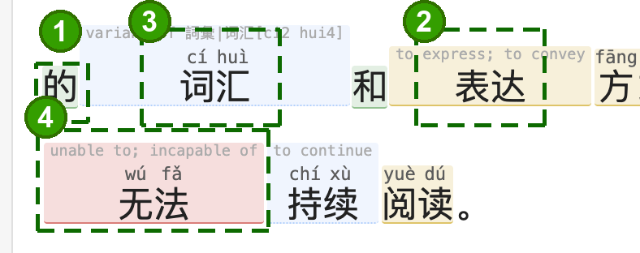

A word's **status drives its color and how much help is shown**:

1. **Known** (green) — characters only; you don't need help.
2. **Partial** (yellow) — adds pinyin / meaning for a word you half-know.
3. **New / untracked** (blue) — full gloss + pinyin + characters.
4. **Unknown** (red) — full gloss + pinyin + characters, flagged for attention.

Those are background tints. The **font** color of each of the three rows —
characters, pinyin, English — is separately settable under **Settings → Display →
Advanced display → Reader text colors** (off by default, so your theme stays in charge).
See [Display modes & colors](./docs/display-modes.md).

### Traditional Chinese (Taiwan / Hong Kong)

Set **Settings → Script & region → Text script** to Traditional, or tick
**Traditional characters** in the reading view's ⋯ menu. Both scripts stay
indexed, so a mixed vault keeps working, and your vocabulary is shared between
them — mark 學習 known and 学习 is known too.

**Pronunciation** can be switched to the Taiwan reading for the ~500 words the
dictionary records one for (垃圾 lè sè rather than lā jī). It does not cover
the neutral-tone difference (謝謝 xièxiè, 東西 dōngxī) — CC-CEDICT has no data
for those. Zhuyin is not supported yet.

Your notes are never rewritten, and words are never converted between scripts
for display — 1,078 Simplified headwords map to more than one Traditional form
and there is no frequency data to pick correctly, so the plugin shows you the
form you actually read.
See [Traditional Chinese & regional pronunciation](./docs/traditional-chinese.md).

### Open the Chinese view (mobile)

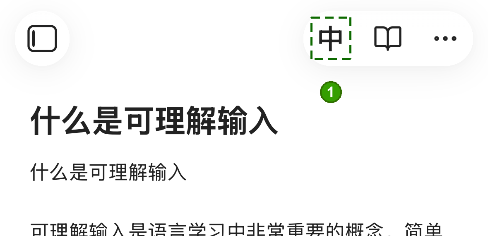

1. From a normal note, tap **中** in the header to open the Chinese view.

### Word lookup card (mobile)


1. **Word, pinyin & meaning** — headword, reading, traditional form, definitions.
2. **"I know"** — tick characters / pinyin / translation; this sets the word's status.
3. **Per-word stats** — HSK, times seen, last seen, status, SRS due date.
4. **Exposure history** — recent sightings driving spaced repetition.
5. **Actions** — Ignore, **Mnemonic** (write your own emoji line + story, or generate them with AI), Edit, or **Enhance** (AI, see below).

### Tap-to-format & highlights (mobile)


1. **Highlighter button** — blue = add formatting (tap again → red remove → off).
2. **Mode banner** — tap a start word then an end word; **Formats ▾** picks the
   format / highlight color, **Exit** leaves.
3. **The applied highlight** spanning the selected words.

<p>

&nbsp;

</p>

<em>Left: the Formats menu (Bold, Italic, headings, quote, and nine highlight
colors). Right: the red <strong>remove</strong> mode — tap a span to strip its
formatting.</em> Full details in [Formatting & highlighting](./docs/formatting.md).

### AI dictionary Enhance (mobile)

A sparse dictionary entry can be enriched by your configured AI provider.

<p>
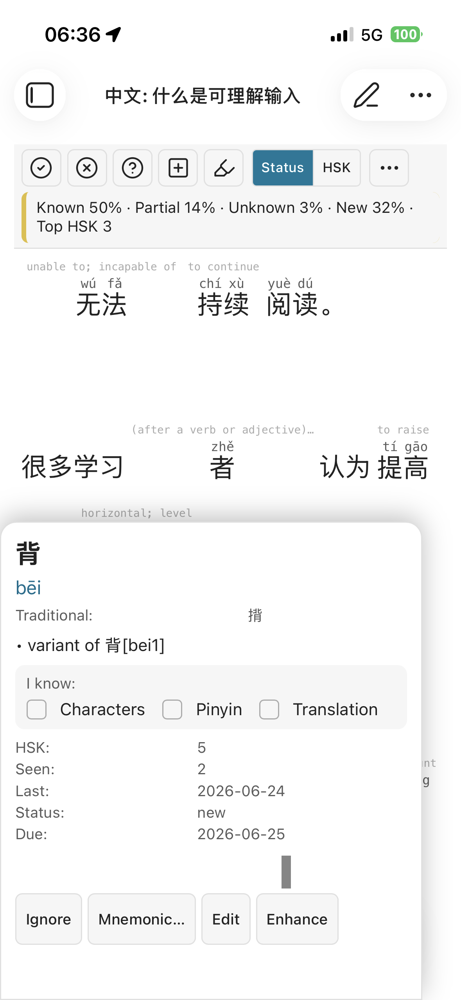
&nbsp;
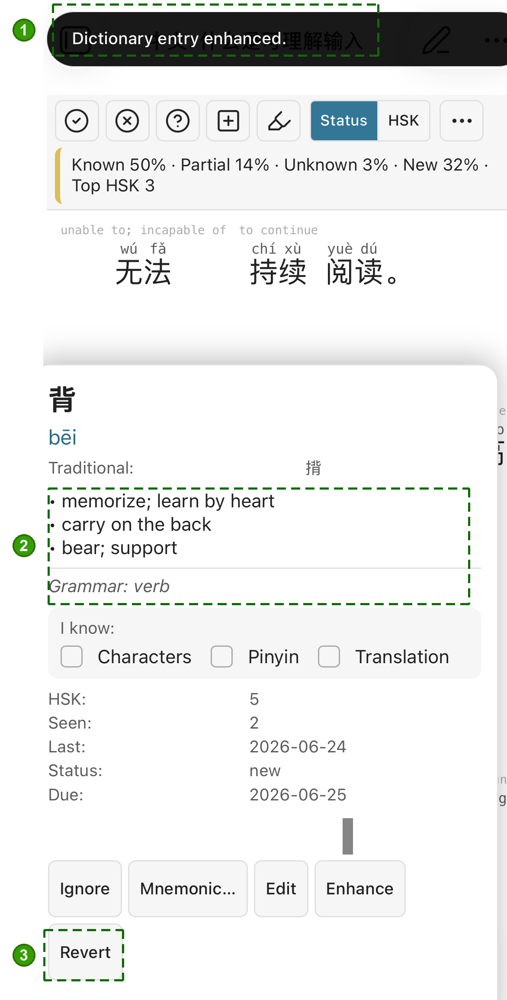
</p>

Left → right, before and after tapping **Enhance**:

1. **"Dictionary entry enhanced"** confirmation.
2. **Enriched definitions + grammar** — full senses replace the bare "variant of…".
3. **Revert** — undo the enhancement.

### Flashcard review (mobile)

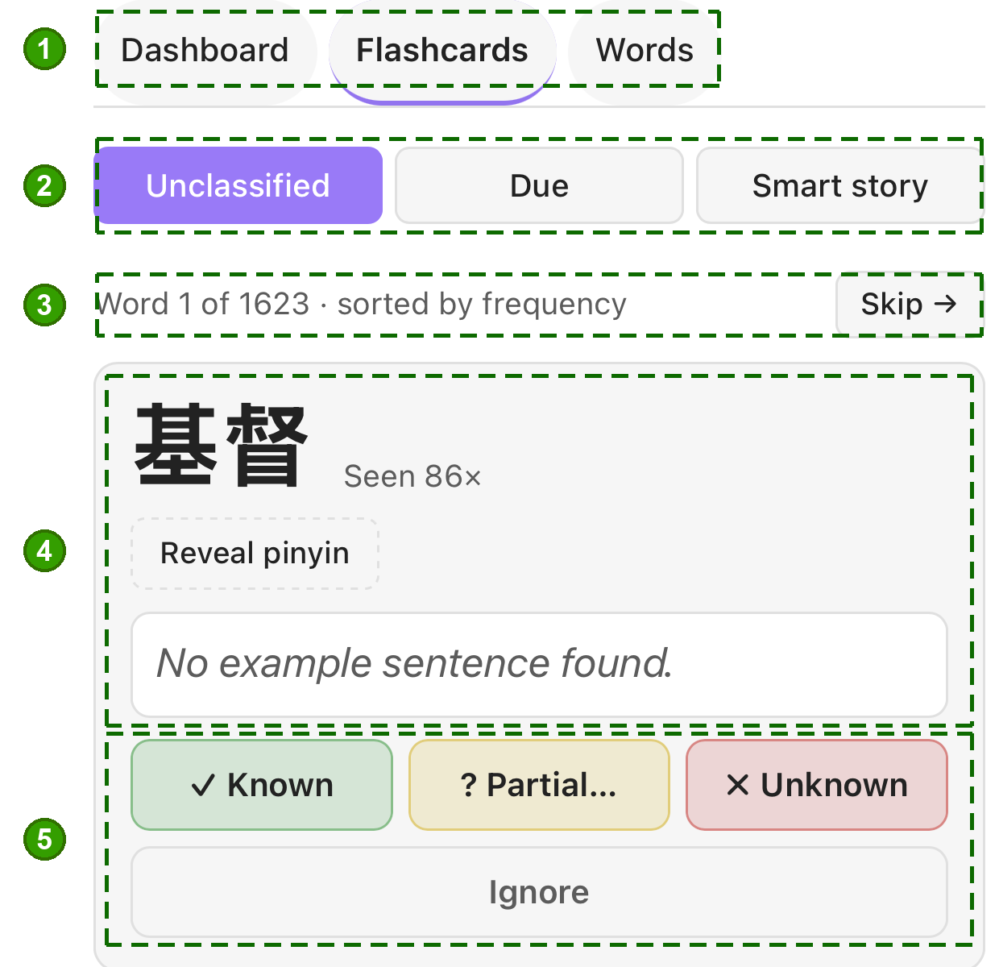

1. **Stats view** — Dashboard / Flashcards / Words.
2. **Review queue** — Unclassified, Due (SRS), or Smart story.
3. **Progress** through the queue (sorted by frequency) · Skip.
4. **The card** — headword, times seen, Reveal pinyin, example sentence.
5. **Grade** — Known / Partial / Unknown, or Ignore.

### Vocabulary stats & Smart stories

<p>
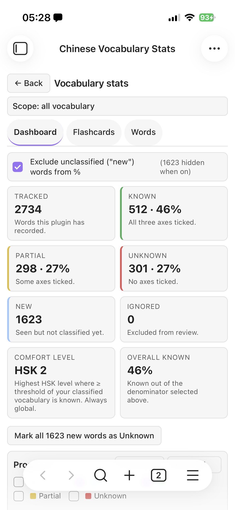
&nbsp;
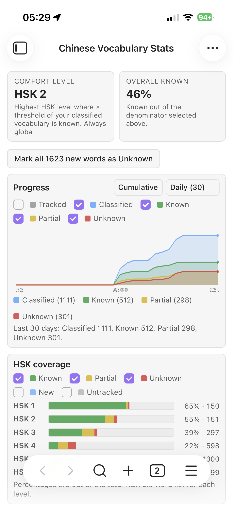
&nbsp;
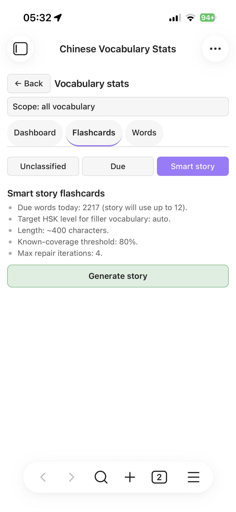
</p>

<em>Tracked / known / partial counts and a comfort-HSK level; cumulative progress
and per-HSK coverage over time; and Smart-story generation that weaves your
due words into a level-appropriate story.</em> See
[Spaced repetition](./docs/srs.md) and [Story generation](./docs/story-generation.md).

## Why This Plugin Exists

Learning a language should be enjoyable. Unfortunately, many learners experience the opposite: endless flashcards, grammar drills, vocabulary lists, and a constant feeling that progress is slow and difficult.

When I started learning Chinese, the biggest breakthrough was discovering Comprehensible Input.

The core idea is simple: instead of memorizing isolated words and grammar rules, you learn by consuming content that is just slightly above your current level. You acquire the language naturally through reading and listening, much like children learn their native language.

Tools such as DuChinese have shown how powerful this approach can be. Reading stories designed for your level is far more engaging than spending hours reviewing flashcards. For a long time, comprehensible input allowed me to progress while enjoying the process.

However, as your Chinese improves, a new problem appears.

At beginner and intermediate levels, common vocabulary appears frequently enough that repeated exposure naturally reinforces it. But as you advance, you start learning increasingly rare words. These words may only appear occasionally, making it difficult to retain them through reading alone. This is the point where many learners feel forced to return to flashcards and traditional spaced repetition systems.

The problem is that flashcards often break the flow and enjoyment of language learning. Instead of reading interesting content, you end up reviewing isolated vocabulary items again.

This plugin explores a different approach.

### Spaced Repetition Through Stories

Instead of using flashcards, this plugin uses stories and meaningful content as the vehicle for spaced repetition.

With the help of AI, it becomes possible to generate or adapt content that naturally includes the vocabulary you need to review. Rather than seeing a word on a card, you encounter it inside a story, dialogue, article, or topic that interests you.

The goal is to combine the effectiveness of spaced repetition with the enjoyment of comprehensible input.

You can import Chinese texts that interest you, track your vocabulary knowledge, and receive content tailored to the words that need reinforcement. Learning becomes less about reviewing cards and more about reading Chinese every day.

### A Better Reading Experience

Many Chinese reading tools provide pinyin and translations for every word. While helpful at first, this creates another problem: learners naturally rely on the easiest information available.

If English translations are always visible, your eyes drift toward English. If pinyin is always displayed, you start reading pinyin instead of recognizing characters.

As a result, character recognition develops more slowly than it should.

This plugin takes a different approach.

Words can be marked as:

- Known
- Partially known
- Unknown

Based on that knowledge, the plugin can selectively display characters, pinyin, or translations only where they are actually needed.

Words you already know remain visible as Chinese characters only, encouraging character recognition and reading fluency. Support is shown only for vocabulary that still requires assistance.

The result is a reading experience that provides help when necessary without constantly encouraging dependence on pinyin or translations.

### Measure Real Progress

Another important aspect of language learning is feedback.

Many learners have only a vague sense of their progress. They know they have studied for months or years, but they cannot easily quantify what they have learned.

By tracking vocabulary knowledge over time, this plugin provides measurable insights into your progress:

- How many words you know
- Which words are improving
- Which words are being forgotten
- Whether your vocabulary is growing over time

Seeing tangible progress can be highly motivating, especially during the long journey of learning Chinese. The goal is not only to make learning more effective, but also to help learners stay motivated by making their improvement visible.

### The Vision

The long-term vision of this project is simple:

Make Chinese learning feel more like reading and less like studying.

By combining comprehensible input, AI-generated content, vocabulary tracking, and story-based spaced repetition, this plugin aims to make language acquisition both effective and enjoyable—even beyond the intermediate stages where traditional comprehensible-input tools begin to struggle.

See `NOTICE.md` for license notes (CC-CEDICT, HSK).

## Install

**Requires Obsidian 1.13.0 or newer** (since 0.5.1 — the settings tab uses
Obsidian's declarative settings API so every setting is searchable).

Available in the **official Obsidian community-plugin store**: Settings →
Community plugins → **Browse** → search **Chinese Comprehensible Input** →
Install → Enable. To test the latest beta builds instead, install via **BRAT**.
Full step-by-step guide (store, BRAT, or manual) in [docs/install.md](./docs/install.md).

## Documentation

Detailed guides live in [`docs/`](./docs/index.md). Each settings section also links to the relevant page from inside Obsidian. Highlights:

- [Install (BRAT or manual)](./docs/install.md) — get the plugin into your vault
- [FAQ](./docs/faq.md) — top issues and where the fix is
- [OpenAI setup, privacy, and cost](./docs/openai-setup.md)
- [Ollama tips: model choice and getting good output](./docs/ollama-tips.md)
- [Mnemonics](./docs/mnemonics.md) — hand-written and AI-generated memory hooks, personalising the prompt
- [Story generation, end to end](./docs/story-generation.md)
- [Display modes & colors](./docs/display-modes.md)
- [Traditional Chinese & regional pronunciation](./docs/traditional-chinese.md) — Taiwan / Hong Kong script, Taiwan readings, and what is not covered
- [Formatting & highlighting](./docs/formatting.md) — tap-to-format mode, colored highlights, Highlightr support
- [Themes & plugin compatibility](./docs/compatibility.md) — Things-style checkboxes, Highlightr, sync tools, and the limits inside the Chinese view
- [Word states (new / partial / known / unknown / ignored)](./docs/word-states.md)
- [Exposure tracking](./docs/exposure.md)
- [Spaced repetition](./docs/srs.md)
- [Vault-mirror sync (for users who don't sync .obsidian/)](./docs/sync-mirror.md)
- [Conflict resolution between devices](./docs/conflicts.md)

### Limitations

- Mobile + Ollama needs a reachable LAN/Tailscale host (`localhost` from the phone points at the phone). See [Ollama tips](./docs/ollama-tips.md#mobile-tailscale-tips).
- OpenAI mode sends prompt + target words to OpenAI's servers — fine for most users, see [the privacy section](./docs/openai-setup.md#2-privacy--your-text-leaves-obsidian).
- The bundled seed dictionary is tiny; real use needs CC-CEDICT (see Data below).

## Dev

```bash
npm install
npm run dev        # watch build
npm run build      # type-check + production bundle
npm test           # vitest
npm run test:cov   # coverage report + threshold enforcement
npm run check-release
```

GitHub Actions runs the same validation set on every PR and on pushes to `main`: build, tests, coverage, and the release guard. Actual BRAT publishing stays manual so the tagged release assets and notes are reviewed before going live.

Development policy:

- Use a dedicated branch for each bugfix, feature, or release-prep change. Preferred prefixes: `fix/`, `feat/`, `release/`.
- Merge changes to `main` through PRs after CI passes.
- External PRs must be approved by the maintainer before merge.

See [CONTRIBUTING.md](./CONTRIBUTING.md) for how to report bugs, suggest features, and open a PR (it's an issues-first project — please open an issue before a non-trivial PR).

To install the dev build into a vault:
1. Build: `npm run build`.
2. Copy `manifest.json`, `main.js`, `styles.css` into `<vault>/.obsidian/plugins/chinese-comprehensible-input/`.
3. Enable in Obsidian → Community plugins.

## Data

A tiny seed dictionary is bundled for development. For real use, drop a CC-CEDICT shard at `<vault>/.cci-dictionary.json` (array of `{simplified, traditional, pinyin, definitions, hsk?}`). See `NOTICE.md` for license notes.

## Privacy

- No data leaves the device unless you configure an AI provider.
- In OpenAI-compatible mode, story generation may send prompt text and target words to the provider you configured.
- API keys are stored locally in Obsidian local storage and are not written to synced vault files.

## Data storage

- Settings, vocabulary state, SRS state, and exposure history are stored in the plugin's local Obsidian data blob.
- If you enable the optional sync mirror, sanitized settings and vocabulary data are also written to JSON files inside your vault. API keys stay local.
- The bundled dictionary is only a small seed set. Normal use expects a user-supplied CC-CEDICT shard at `<vault>/.cci-dictionary.json`.
