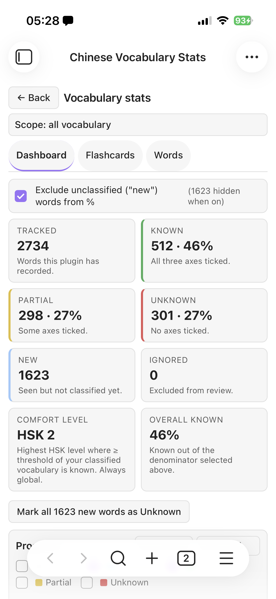
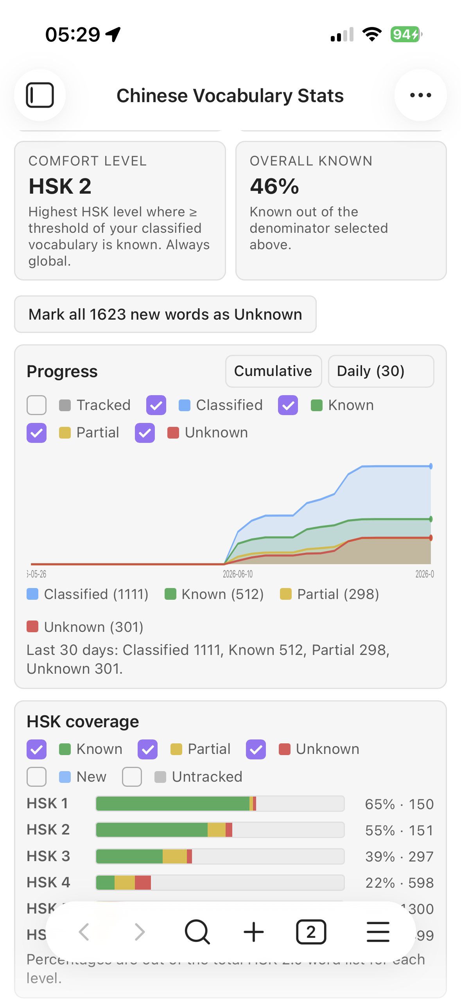

# Exposure tracking

An "exposure" is a record that you met a word. Exposures drive the
**statistics** — how often you have seen a word, the daily graphs, HSK
coverage, which notes a word appears in. This page explains exactly what
counts and the dedup rules.

> **Changed in 0.7.8.** Earlier versions of this page described exposure as
> something the plugin measured by watching words scroll through the reading
> view, and as something that moved a word toward "known" on its own. Neither
> was ever implemented — the settings and the prose promised more than the code
> did. This page now describes what actually happens. Viewport-based counting is
> still wanted and is tracked as its own piece of work; word **status** stays
> yours to set.

The payoff shows up in **Vocabulary stats** — the dashboard tiles, the
cumulative progress chart, per-HSK coverage over time, and a Topic coverage radar showing which subjects your vocabulary actually covers:

&nbsp;

## What counts as an exposure

Three things, and only these three:

1. **Opening a word popup.** Long-press (or tap, depending on your settings) a
   word and look at its card — you have definitely seen it. Controlled by
   **Popup counts as exposure** below.
2. **Words in a generated story.** The target words of a generated reading count
   when the note is created. Controlled by **Generated reading counts as
   exposure**.
3. **The vault index.** "Re-index vault" walks every note and records each
   word's occurrences. This is how most of your counts appear in the first
   place. It is idempotent, so re-running it does not inflate anything.

**Simply scrolling a note past your eyes does not count.** There is no
visibility timer. If you want reading itself to contribute, the honest answer
today is to open the popup on words you actually studied, or re-index after
adding notes.

## Settings under Exposure tracking

The two dedup limits below apply to the **popup** path. Generated stories record
exposures directly and are not deduplicated by them, and the vault index does
its own reconciliation.

### Max once per note per session

Default **on**. A single word in a single note can count as exposed
only once per session, no matter how long you stare at it. Prevents
"sitting on one paragraph" from inflating your stats.

### Max once per day

Default **off**. When on, a word can't be counted again on the same
calendar day even across different notes. Useful if you re-read the same
material a lot and want a stricter dedup.

### Popup counts as exposure

Default **on**. When you long-press a word and look at the popup, that
counts as an exposure (you definitely saw it). Turn off if you want
popups to be neutral — just a lookup, not a contribution to known-ness.

### Generated reading counts as exposure

Default **on**. Words in generated stories count toward exposure totals
just like words in your own notes. Turn off if you want a clean split
between "real reading" and "AI-generated practice."

## Exposure and word status

**Exposure does not change a word's status.** Nothing promotes a word to
*known* automatically, however many times you have seen it. Status is yours:

- Long-press a word → **Mark known / partial / unknown / ignored**.
- Or set it from the **Vocabulary stats** dashboard.

That is deliberate. Your own judgement of whether you know a word carries far
more information than a count of how many times it crossed the screen, and a
count that quietly promoted words would make the dashboard describe your
reading rather than your knowledge.

What exposure *does* feed is everything counting-shaped: the "seen N×" figure on
the word card, the per-word daily sparkline, the dashboard's sort order and
top-words ranking, per-note coverage, and the cumulative progress and HSK
coverage charts.

## The interaction with SRS

Once a word is **known**, it enters the spaced repetition queue (see
[SRS](./srs.md)). Two things move that schedule, and reading is not one of them:

- **A popup on a due word** counts as a failed recall, if **Popup on due is
  failed recall** is on — the reasoning being that needing to look a word up is
  evidence you did not recall it.
- **Grading a card by hand** from the dashboard.

Seeing a word in a note does not extend its interval.

## When to tune the dedup rules

- **You're a first-time user** who's never read Chinese in Obsidian:
  leave defaults, and run **Re-index vault** once so your existing notes are
  counted.
- **You re-read the same materials a lot** (textbook chapters, song
  lyrics): turn on **Max once per day** so exposure counts reflect
  fresh reads, not repeats.
- **You use the popup as a translator, not a fail signal**: turn off
  **Popup counts as exposure**.

## See also

- [Spaced repetition](./srs.md) — what happens after a word is known.
- [Word states](./word-states.md) — the full status taxonomy.
- [FAQ](./faq.md)
