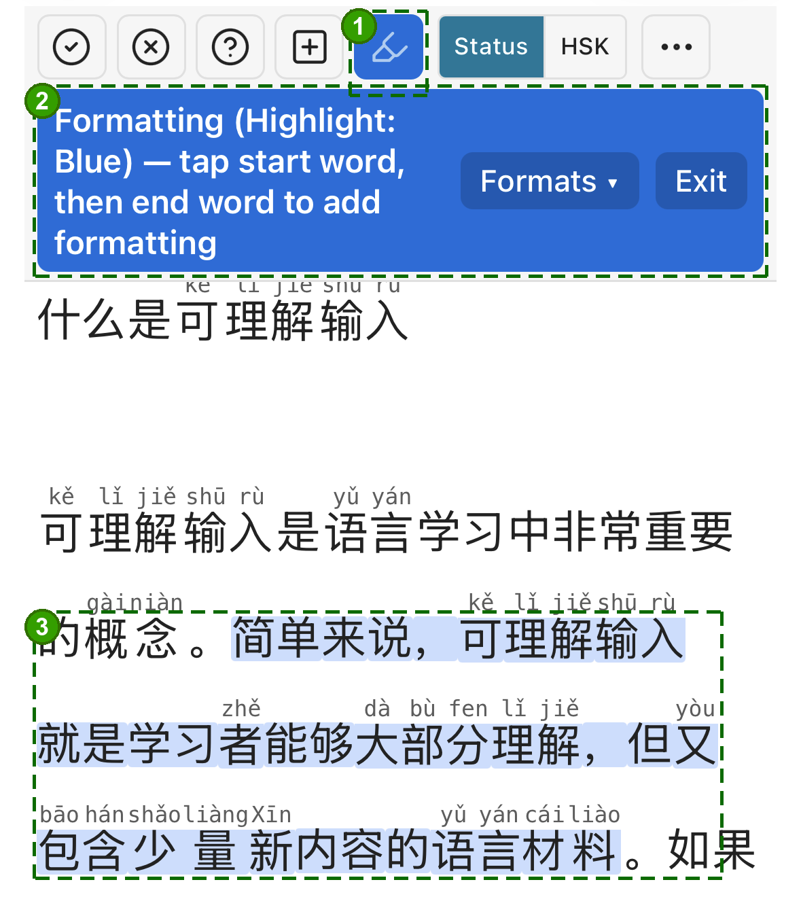
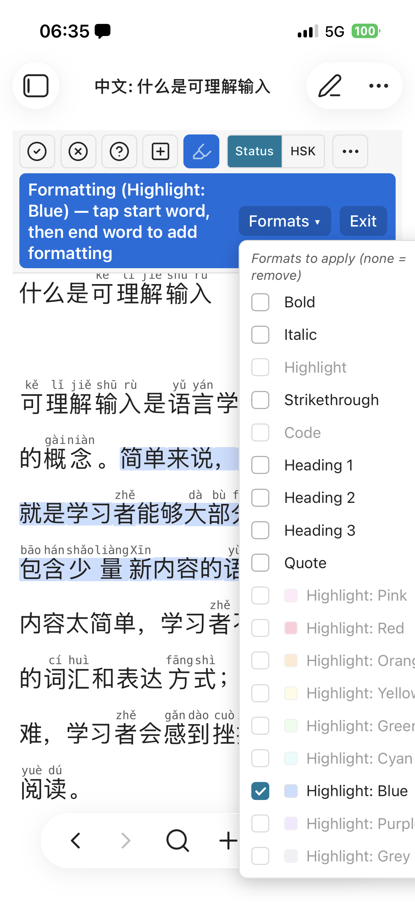
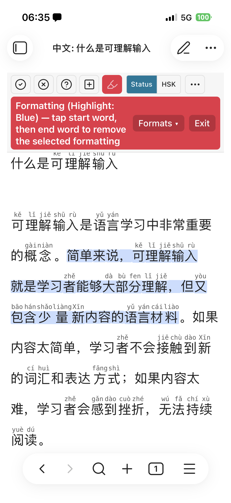

# Formatting and highlighting in the Chinese view

The Chinese view has a tap-driven **formatting mode**: pick a start word and an
end word, and the span between them is wrapped in real Markdown (it's written
into the `.md` file, so it shows everywhere — the Chinese view, the native
Markdown view, and any sync target). The headline use is **highlighting** for
review, but the same mode applies bold, italic, strikethrough, inline code,
headings, and block quotes.

1. **Highlighter button** — blue = add (tap again → red remove → off).
2. **Mode banner** — tap a start word then an end word; **Formats ▾** picks the
   format / highlight color, **Exit** leaves.
3. **The applied highlight** spanning the selected words.

## The highlighter button (add / remove / off)

The highlighter icon in the view toolbar is a three-state toggle:

1. **First tap → blue (add).** You're in formatting mode. Tap a start word, then
   an end word, and the span gets the armed format(s).
2. **Second tap → red (remove / reverse).** Same tap-start-then-end gesture, but
   now it *removes* the armed format(s) from the span instead of adding them.
3. **Third tap → off.** Back to normal reading.

The banner under the toolbar tells you the current mode, which formats are armed,
and — after your first tap — which start word was registered.

## Choosing what to apply: the Formats dropdown

The **Formats ▾** button in the banner opens the picker. Tick the formats you
want armed:

- **Highlight** (default), **Bold**, **Italic**, **Strikethrough**, **Inline
  code**, **Headings (H1–H3)**, **Quote**.
- **Colored highlights** — one entry per color (see below).

&nbsp;

*Left: the Formats picker (text formats plus nine highlight colors). Right: the
red **remove** mode — the banner turns red and a tap-start/tap-end gesture strips
the armed format(s) from the span.*

Mutually exclusive choices are disabled automatically (e.g. you can't arm two
heading levels at once). In **remove** mode (red button) the conflict gating is
relaxed — you can clear several formats in one gesture.

You can leave the picker with **nothing** ticked: an empty selection in add mode
*clears* all formatting from the span (a quick "unformat").

## Colored highlights and Highlightr

Colored highlights are written as `<mark style="background:#…">…</mark>`, which
renders in the Chinese view with no extra setup.

- If the **[Highlightr](https://github.com/chetachiezikeuzor/Highlightr-Plugin)**
  plugin is installed, the color list mirrors *its* palette and order, so your
  highlights look identical in the normal Markdown view too.
- If it isn't installed, the color options are hidden by default. Turn on
  **Settings → Formatting picker → "Show highlight colors without Highlightr"**
  to use a built-in default palette (Pink, Red, Orange, Yellow, Green, Cyan,
  Blue, Purple). They render inside the Chinese view; install Highlightr to make
  them render elsewhere and to customize the palette.

The plain `==…==` highlight is always available and needs no plugin.

### Links stay clickable

Highlighting a span that contains a `[[wikilink]]`, `![[embed]]`, or
`[text](url)` keeps the link working. For a colored `<mark>`, the highlight is
split *around* the link (`<mark>前 </mark>[[note]]<mark> 后</mark>`) so the link
syntax stays outside the raw HTML — otherwise the native Markdown view would stop
recognizing it. The link itself isn't colored, but it always opens.

## How highlights look in the reader

The highlight is a single continuous band across the **characters only** — pinyin
and the English gloss above them are never painted. It's the same height whether a
word has annotations or not, and it scales up inside headings. Digits and
punctuation at the edges of a selection (e.g. a line like `1. 你好？`) are
included.

### Highlight vs. status / HSK colors

If a word has both a highlight and a status or HSK color, the
**Settings → Formatting picker → "Highlight overrides status / HSK colors"**
toggle decides which one shows:

- **On (default):** the highlight wins — the status tint is hidden under it.
- **Off:** the status/HSK color wins and the highlight band is hidden for that
  word.

## Reordering and hiding formats

Under **Settings → Formatting picker** you can drag the format list into the
order you prefer and untick any option to hide it from the in-view dropdown — so
the picker only shows the formats (and colors) you actually use.

## Safety

Formatting only ever adds or removes Markdown markup — it never changes the
underlying text. A guard compares the note's plain text before and after every
formatting action and aborts (with a notice) if they would differ, so a mis-tap
can't corrupt a note.

## See also

- [Display modes and colors](./display-modes.md) — status / HSK tints, which the
  highlight can override.
- [Word states](./word-states.md) — the status colors highlights sit on top of.
