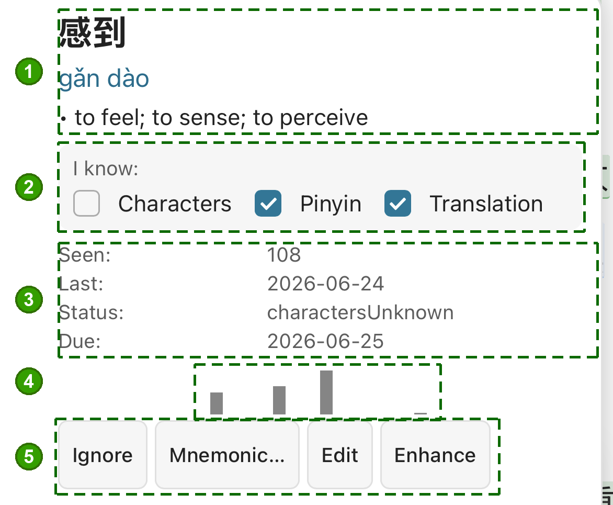

# Word states (new / partial / known / unknown / ignored)

Every Chinese word the plugin sees gets a **status** that drives:

- Which color it shows in the reading view (if any).
- Whether the popup opens by default on tap.
- Whether the spaced repetition system schedules it.
- Whether it shows up in flashcards.

This page is the source of truth on what each state means and how to
move words between them.

## The states

| Status | What it means | Default color tint |
|--------|---------------|--------------------|
| **new** | Plugin has seen the word but doesn't have a real opinion yet. The starting state for anything you haven't marked. | Subtle blue (off by default) |
| **partial** | You half-know the word: maybe the meaning but not the pinyin, or vice versa, or you recognize one character. | Yellow / amber |
| **known** | You own the word. No popup by default. Enters the SRS so it doesn't fade. | Green (off by default — clean reading) |
| **unknown** | You explicitly marked this word as something you don't know. Popup-only by default — no inline annotation. | Red |
| **ignored** | Don't show this word in any list / color / popup. Useful for proper nouns, particles you don't care about, or junk. | None |
| **charactersUnknown** | Variant of partial: the characters confuse you regardless of meaning. | Yellow |
| **meaningKnownPinyinUnknown** | You know what it means but not how to say it. | Yellow |
| **pinyinKnownMeaningUnknown** | You can say it but don't know what it means. | Yellow |

The three sub-flavors of "partial" all paint yellow and behave the same
for review purposes — they exist so the popup can show you *why* it's
partial.

## How to change a word's state

Three ways, in increasing weight:

1. **The popup.** Long-press the word in the Chinese view to open the
   popup card. Tick the "I know" boxes to set status directly.

   

   1. **Word, pinyin & meaning** · 2. **"I know"** — tick characters / pinyin /
   translation to set the status · 3. **Per-word stats** (HSK, seen, last,
   status, SRS due) · 4. **Exposure history** · 5. **Actions** — Ignore, add a
   Mnemonic by hand, generate one with **Mnemonic ✨**, Edit, or **Enhance**
   (the last two AI — see [OpenAI setup](./openai-setup.md)).
2. **Marking modes in the toolbar.** Switch the view into Mark known /
   Mark unknown / Mark partial mode using the toolbar buttons. Now
   single-tapping any word sets it to that status. Switch back to
   Read when done.
3. **Manual edit in the JSON.** For bulk fixes, edit the vault mirror
   file (see [sync-mirror](./sync-mirror.md)) — but the in-app paths
   are normally enough.

## The "select word" mode

The toolbar has a fourth marking mode: **Select word**. This lets you
tap a sequence of characters or words and bundle them into a single
**custom word** entry — useful when the tokenizer split a phrase that
should have stayed together (e.g. a proper noun, a chengyu it didn't
recognize). The collected surface gets its own vocabulary entry you can
status-mark like any other.

## Color toggles

Display settings has on/off switches for each color tint:

- **Show known color** — default off. Reading flows better when known
  words are uncolored; flip on if you want a visual reward for
  graduations.
- **Show partial color** — default on. Helps you spot half-known words
  to revisit.
- **Show unknown color** — default on. Red flags the words to study next.
- **Show new color** — default on. Subtle blue for unclassified words.

In **HSK color mode** (set under Color mode), every word is colored by
its HSK level instead of by status. Useful for graded reading where you
want to see roughly which level a passage targets.

## Popup behaviour by status

- **New / partial / unknown**: popup opens on tap by default.
- **Known**: popup opens only if you've turned on **Known word popups**
  in display settings. Off by default for clean reading.

## See also

- [Display modes](./display-modes.md) — colors, two-line vs three-line,
  pinyin styles.
- [Spaced repetition](./srs.md) — what happens after a word is known.
- [Conflicts](./conflicts.md) — what happens when two devices set
  different statuses on the same word.
- [FAQ](./faq.md)
